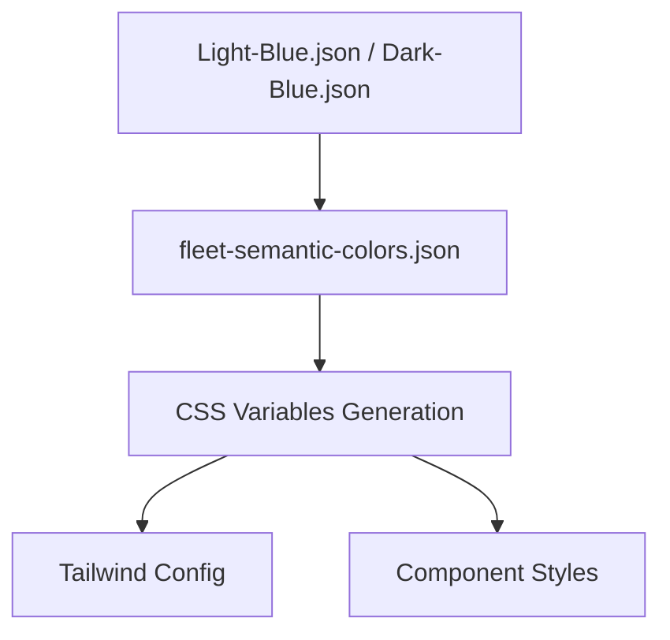

# Fleet Air Web Components

A React component library that mirrors Fleet Air (Compose) components for web prototyping. This project recreates JetBrains Fleet's Compose-based UI components in React to enable rapid web prototyping using familiar Fleet design patterns.

## 🚀 Quick Start

```bash
# Install dependencies
npm install

# Start development server
npm run dev

# Build for production
npm run build

# Start production server
npm run start
```

Visit `http://localhost:3000` to see the component examples and documentation site.

## 📦 Components

The library includes the following core components:

- **[TextInput](./TEXT_INPUT_IMPLEMENTATION.md)** - Comprehensive input component with all Fleet variants
- **[Typography](./TYPOGRAPHY_SYSTEM_FIXES.md)** - Complete Fleet typography system with 20+ variants
- **[Button](./BUTTON_IMPLEMENTATION.md)** - Fleet-inspired button with all variants and features
- **[Tabs](./TABS_IMPLEMENTATION.md)** - Complete Fleet tabs system with pixel-perfect implementation
- **[Island](./ISLAND_IMPLEMENTATION.md)** - Fleet container components for organizing content
- **[MainToolbar](./MAIN_TOOLBAR_IMPLEMENTATION.md)** - Complete Fleet main toolbar system
- **[Icons](./ICON_IMPLEMENTATION.md)** - Comprehensive icon system supporting Fleet and Lucide icons
- **[List](./LIST_IMPLEMENTATION.md)** - Fleet list components for data display

Each component has detailed implementation documentation in the linked files.

## 🎨 Design System

### Color System Architecture



See [Color Implementation](./COLOR_IMPLEMENTATION.md) for detailed documentation.

### Typography System

Fleet-inspired typography with proper font weights, sizes, and line heights. All components use consistent CSS utility classes for typography.

See [Typography System Fixes](./TYPOGRAPHY_SYSTEM_FIXES.md) for detailed documentation.

## 🛠 Technologies

- **React 19** - Latest React with modern features
- **TypeScript** - Full type safety
- **Next.js 15** - App Router and modern features
- **Tailwind CSS 4** - Utility-first styling
- **shadcn/ui** - Accessible component foundation
- **Radix UI** - Unstyled, accessible primitives
- **Class Variance Authority (CVA)** - Type-safe component variants
- **Lucide React** - Modern icon library

## 📁 Project Structure

```
fleet/air-web-components/
├── src/
│   ├── app/                        # Next.js App Router pages & examples site
│   │   ├── page.tsx               # Landing page
│   │   ├── layout.tsx             # Root layout with theme provider
│   │   ├── globals.css            # Global styles + CSS variable imports
│   │   └── examples/              # All examples and documentation pages
│   ├── components/
│   │   ├── ui/                    # Core UI components
│   │   ├── app-layout.tsx         # Shared layout with navigation
│   │   └── theme-provider.tsx     # Theme context provider
│   ├── lib/
│   │   ├── utils.ts               # cn() utility and helpers
│   │   ├── fleet-icons.ts         # Fleet icon registry (200+ icons)
│   │   ├── fleet-semantic-colors.json # Semantic color mappings
│   │   └── fleet-palette.json     # Color palette definitions
│   └── scripts/                   # Color system generation scripts
├── public/
│   └── icons/                     # Fleet icon assets
├── docs/                          # Implementation documentation
├── fleet-semantic-vars-light.css  # Generated CSS variables (light theme)
├── fleet-semantic-vars-dark.css   # Generated CSS variables (dark theme)
├── components.json                # shadcn/ui configuration
├── tailwind.config.js             # Tailwind + Fleet color integration
└── package.json
```

## 🎯 Goals

1. **Mirror Fleet Air components** - Recreate Compose UI in React with exact color and typography matching
2. **Accessibility first** - Built on Radix UI primitives via shadcn/ui
3. **Type safety** - Full TypeScript support with strict mode
4. **Developer experience** - Easy to use, extend, and maintain
5. **Prototyping ready** - Drop into any React app for Fleet-like UI
6. **Theme-aware** - Automatic light/dark mode support
7. **Design fidelity** - Pixel-perfect Fleet design system implementation

## 🚧 Development

### Component State Management Strategy

**CRITICAL**: All components MUST follow the **prototyping-first design pattern**:

#### Self-Managing with Optional External Control

```typescript
// ✅ Prototyping mode - works immediately
<Component />

// ✅ Advanced mode - full external control when needed
<Component 
  data={customData}
  onAction={customHandler}
/>
```

#### Implementation Pattern

1. **Make props optional** - Component works without any required props
2. **Provide default state** - Include sensible defaults for prototyping
3. **Support external control** - Accept optional props to override defaults
4. **Handle both modes** - Check for external handlers before using internal ones

#### Benefits
- **Rapid prototyping** - Drop components in without setup
- **Progressive enhancement** - Add complexity only when needed  
- **Consistent API** - Same component works in simple and complex scenarios
- **Reduced boilerplate** - No required state management

See **AiChatContextPreview** implementation as the reference example.

### Adding New Components

1. **Create component** in `src/components/ui/`
2. **Implement self-managing pattern** for all interactive components
3. **Use Fleet CSS variables** for all colors (`var(--fleet-*)`)
4. **Use Typography component** for all text elements
5. **Follow Fleet patterns** for behavior and styling
6. **Export from index** files
7. **Create example page** in `src/app/examples/`
8. **Add documentation** in `docs/` if complex

See [Component Conversion Pipeline](./COMPONENT_CONVERSION_PIPELINE.md) for detailed guidance.

## 📝 License

This project is for internal JetBrains use, mirroring Fleet's design system for web prototyping.

## 🔗 Key Pages

- **Landing Page**: `/` - Project overview and quick start
- **Colors**: `/examples/colors` - Complete color palette and semantic tokens explorer
- **Buttons**: `/examples/buttons` - All button variants, sizes, and features
- **Text Inputs**: `/examples/text-inputs` - All TextInput variants, sizes, and features
- **Tabs**: `/examples/tabs` - All tab variants, states, and Fleet Gallery implementations
- **Islands**: `/examples/islands` - Fleet container components with 6px padding and seamless tab integration
- **MainToolbar**: `/examples/main-toolbar` - Fleet main toolbar with intelligent layout and context menus
- **Typography**: `/examples/typography` - Typography system showcase
- **Icons**: `/examples/icons` - Fleet and Lucide icon galleries