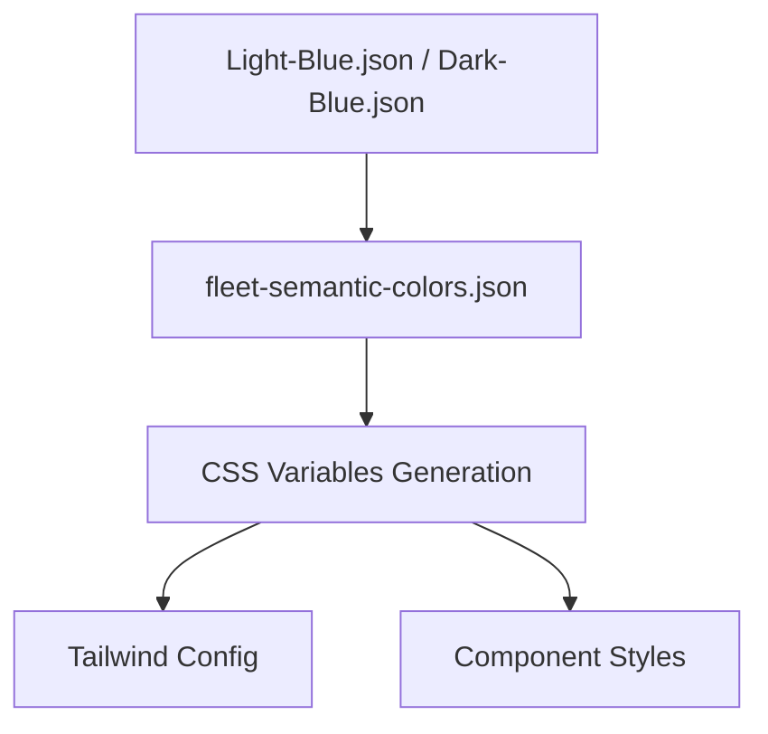

# Fleet Air Web Components

A React component library that mirrors Fleet Air (Compose) components for web prototyping. This project recreates JetBrains Fleet's Compose-based UI components in React to enable rapid web prototyping using familiar Fleet design patterns.

## 🚀 Quick Start

```bash
# Install dependencies
npm install

# Start development server
npm run dev

# Build for production
npm run build

# Start production server
npm run start
```

Visit `http://localhost:3000` to see the component examples and documentation site.

## 📦 Components

### Typography
Complete Fleet typography system with 20+ variants covering headers, body text, and code text.

**Variants:**
- Headers: `header-1-semibold`, `header-2-semibold`, `header-3-semibold`, etc.
- Body: `default`, `medium`, `small`, `default-semibold`
- Code: `code`, `code-bold`, `code-italic`

**Usage:**
```tsx
import { Typography } from "@/components/ui/typography"

<Typography variant="header-2-semibold">Fleet Component</Typography>
<Typography variant="default" className="text-muted-foreground">
  Description text
</Typography>
<Typography variant="code">const example = "code";</Typography>
```

### Button
Fleet-inspired button component with all Fleet button variants, advanced features, and proper sizing. **Based on shadcn/ui Button, extended for Fleet Air design and color system.**

**Variants:**
- `primary` - Uses `button.primary.background.default` for primary actions
- `secondary` - Uses `button.secondary.border.default` with transparent background for secondary actions  
- `dangerous` - Uses `button.dangerous.background.default` for destructive actions
- `positive` - Uses `button.positive.background.default` for positive actions
- `warning` - Uses `button.warning.background.default` for warning actions
- `ghost` - Transparent with hover for subtle actions
- `link` - Text link styling

**Sizes:**
- `sm` - 20px height (Fleet small button)
- `default` - 24px height (Fleet default button)
- `lg` - 28px height (Fleet large button)
- `icon` - Square icon-only button

**Advanced Features:**
- Loading state with spinner
- Left/right icons and custom icon support
- Toggle, Split, and Menu button variants
- Hint text and accessibility features
- Theme-aware using Fleet CSS variables

**Usage:**
```tsx
import { Button, ToggleButton, SplitButton, MenuButton } from "@/components/ui/button"

// Basic usage
<Button variant="primary">Save Changes</Button>
<Button variant="secondary" size="sm">Cancel</Button>
<Button variant="dangerous" disabled>Delete</Button>

// Advanced features
<Button variant="primary" iconLeft="settings" isLoading>
  Save Changes
</Button>
<ToggleButton selected={isOn}>Toggle</ToggleButton>
<SplitButton onMenuClick={openMenu}>Split Action</SplitButton>
<MenuButton menuOpen={open}>Menu</MenuButton>

// As child component (using asChild prop)
<Button asChild>
  <Link href="/dashboard">Go to Dashboard</Link>
</Button>
```

### Icons
Comprehensive icon system supporting both Fleet icons (200+ icons) and Lucide icons (5000+ icons) with unified API.

**Fleet Icons:**
- **200+ Fleet Design System Icons**: AI, development, file types, navigation
- **Theme-Aware**: Automatic light/dark theme switching
- **Fixed Colors**: Maintain original Fleet colors, don't inherit text color

**Lucide Icons:**
- **5000+ Modern Icons**: For rapid prototyping and general use
- **Customizable**: Inherit text color, custom stroke widths (default: 1px)
- **Type-Safe**: Full TypeScript support with auto-completion

**Sizes:** `xs` (12px), `sm` (16px), `md` (20px), `lg` (24px), `xl` (32px), `2xl` (40px)

**Usage:**
```tsx
import { Icon, FleetIcon, LucideIcon } from "@/components/ui/icon"

// Unified component
<Icon fleet="terminal" size="md" />
<Icon lucide="Terminal" size="md" />

// Fleet-specific (theme-aware, fixed colors)
<FleetIcon fleet="ai-chat" size="md" />
<FleetIcon fleet="file-types-typescript" size="lg" />

// Lucide-specific (customizable stroke width)
<LucideIcon lucide="Settings" size="md" strokeWidth={1} />
<LucideIcon lucide="Star" size="lg" strokeWidth={2} />
```

### Colors
Complete Fleet color palette with 200+ colors organized in 12 categories plus 80+ semantic tokens. **Fully theme-aware with CSS variables.**

**Color Categories:**
- **Neutral Colors**: 18 shades from White to Black
- **Blue Colors (Accent)**: 16 shades of Fleet's primary blue
- **Semantic Colors**: 80+ tokens for buttons, text, backgrounds, etc.
- **File Type Colors**: Specialized colors for syntax highlighting
- **AI Colors**: Specific colors for AI features and chat

**Theme System:**
- **JSON-Based**: Colors defined in `Light-Blue.json` and `Dark-Blue.json`
- **CSS Variables**: All semantic tokens available as CSS variables
- **Automatic Theme Switching**: Components adapt to light/dark mode
- **Tailwind Integration**: All Fleet colors available as Tailwind utilities

## 🎨 Design System

### Color System Architecture



**Color Resolution:**
```tsx
// Semantic colors map to palette colors, then to hex values
"text.primary" → "Neutral_140" → "#E0E1E4"
"button.primary.background.default" → "Blue_90" → "#0870E4"
```

**Usage in Components:**
```tsx
// ✅ Preferred: Use Fleet CSS variables
className="bg-[var(--fleet-button-primary-background-default)] text-[var(--fleet-button-primary-text-default)]"

// ✅ Good: Use semantic color variables when available
className="bg-primary text-primary-foreground"

// ❌ Avoid: Generic colors that don't match Fleet
className="bg-blue-500" // Use Fleet Blue_90 (#0870E4) instead
```

### Typography System
Fleet-inspired typography with proper font weights, sizes, and line heights:

```tsx
// Typography follows Fleet's type scale
"header-1-semibold": 24px / 32px / 600 weight
"default": 13px / 20px / 400 weight  
"code": 12px / 16px / JetBrains Mono
```

## 🛠 Technologies

- **React 19** - Latest React with modern features
- **TypeScript** - Full type safety
- **Next.js 15** - App Router and modern features
- **Tailwind CSS 4** - Utility-first styling
- **shadcn/ui** - Accessible component foundation
- **Radix UI** - Unstyled, accessible primitives
- **Class Variance Authority (CVA)** - Type-safe component variants
- **Lucide React** - Modern icon library

## 📁 Project Structure

```
fleet/air-web-components/
├── src/
│   ├── app/                        # Next.js App Router pages & examples site
│   │   ├── page.tsx               # Landing page
│   │   ├── layout.tsx             # Root layout with theme provider
│   │   ├── globals.css            # Global styles + CSS variable imports
│   │   └── examples/              # All examples and documentation pages
│   │       ├── colors/page.tsx    # Colors showcase (200+ colors, 80+ tokens)
│   │       ├── buttons/page.tsx   # Buttons showcase (all variants & features)
│   │       ├── typography/page.tsx# Typography showcase
│   │       ├── icons/page.tsx     # Icons showcase (Fleet + Lucide)
│   │       └── test-icons/page.tsx# Icon debugging page
│   ├── components/
│   │   ├── ui/                    # Core UI components
│   │   │   ├── typography.tsx     # Typography component
│   │   │   ├── button.tsx         # Button system (all variants)
│   │   │   ├── icon.tsx           # Unified icon system
│   │   │   └── index.ts           # Component exports
│   │   ├── app-layout.tsx         # Shared layout with navigation
│   │   └── theme-provider.tsx     # Theme context provider
│   ├── lib/
│   │   ├── utils.ts               # cn() utility and helpers
│   │   ├── fleet-icons.ts         # Fleet icon registry (200+ icons)
│   │   ├── fleet-semantic-colors.json # Semantic color mappings
│   │   └── fleet-palette.json     # Color palette definitions
│   └── scripts/                   # Color system generation scripts
├── public/
│   └── icons/                     # Fleet icon assets
│       ├── light/                 # Light theme icons (flat structure)
│       └── dark/                  # Dark theme icons (flat structure)
├── docs/                          # Implementation documentation
│   ├── BUTTON_IMPLEMENTATION.md   # Button system details
│   ├── COLOR_IMPLEMENTATION.md    # Color system architecture
│   └── ICON_IMPLEMENTATION.md     # Icon system details
├── fleet-semantic-vars-light.css  # Generated CSS variables (light theme)
├── fleet-semantic-vars-dark.css   # Generated CSS variables (dark theme)
├── components.json                # shadcn/ui configuration
├── tailwind.config.js             # Tailwind + Fleet color integration
└── package.json
```

## 🎯 Goals

1. **Mirror Fleet Air components** - Recreate Compose UI in React with exact color and typography matching
2. **Accessibility first** - Built on Radix UI primitives via shadcn/ui
3. **Type safety** - Full TypeScript support with strict mode
4. **Developer experience** - Easy to use, extend, and maintain
5. **Prototyping ready** - Drop into any React app for Fleet-like UI
6. **Theme-aware** - Automatic light/dark mode support
7. **Design fidelity** - Pixel-perfect Fleet design system implementation

## 🚧 Development

### Adding New Components

1. **Create component** in `src/components/ui/`
2. **Use Fleet CSS variables** for all colors (`var(--fleet-*)`)
3. **Use Typography component** for all text elements
4. **Follow Fleet patterns** for behavior and styling
5. **Export from index** files
6. **Create example page** in `src/app/examples/`
7. **Add documentation** in `docs/` if complex

### Color System Usage

```tsx
// ✅ Preferred: Use Fleet semantic CSS variables
className="bg-[var(--fleet-button-primary-background-default)] hover:bg-[var(--fleet-button-primary-background-hover)]"

// ✅ Good: Use resolved Fleet colors for complex scenarios
const fleetColor = "#0870E4" // Blue_90 from palette

// ❌ Avoid: Generic colors that don't match Fleet
className="bg-blue-500" // Use Fleet Blue_90 (#0870E4) instead
```

### Icon System Usage

```tsx
// ✅ Fleet icons for Fleet-specific UI
<Icon fleet="ai-chat" size="md" />
<Icon fleet="file-types-typescript" size="lg" />

// ✅ Lucide icons for general prototyping
<Icon lucide="Settings" size="md" strokeWidth={1} />
<Icon lucide="Star" size="lg" />

// ✅ Unified component for flexibility
<Icon fleet="run" size="md" />
<Icon lucide="Play" size="md" />
```

### Typography Usage

```tsx
// ✅ Preferred: Use Typography component with Fleet variants
<Typography variant="header-2-semibold">Component Title</Typography>
<Typography variant="default" className="text-[var(--fleet-text-secondary)]">
  Description text
</Typography>

// ✅ Good: Combine with Fleet semantic colors
<Typography variant="code" className="text-[var(--fleet-text-accent)]">
  Code snippet
</Typography>

// ❌ Avoid: Raw HTML elements without Typography wrapper
<h2>Title</h2> // Should use Typography with header variant
<p>Text</p>   // Should use Typography with body variant
```

## 📝 License

This project is for internal JetBrains use, mirroring Fleet's design system for web prototyping.

## 📚 Implementation Documentation

Detailed implementation guides for core systems are located in the [`docs/`](./docs/) folder:

- **[Button Implementation](./docs/BUTTON_IMPLEMENTATION.md)**: Complete Fleet button system with all variants, sizes, states, and advanced features. Theme-aware, accessible, and fully type-safe.
- **[Color System Implementation](./docs/COLOR_IMPLEMENTATION.md)**: Comprehensive, theme-aware Fleet color system with semantic tokens, palette, CSS variables, and Tailwind integration.
- **[Icon System Implementation](./docs/ICON_IMPLEMENTATION.md)**: Unified Fleet + Lucide icon system with 200+ Fleet icons, 5000+ Lucide icons, theme support, and dynamic loading.

## 🔗 Key Pages

- **Landing Page**: `/` - Project overview and quick start
- **Colors**: `/examples/colors` - Complete color palette and semantic tokens explorer
- **Buttons**: `/examples/buttons` - All button variants, sizes, and features
- **Typography**: `/examples/typography` - Typography system showcase
- **Icons**: `/examples/icons` - Fleet and Lucide icon galleries
- **Icon Debug**: `/examples/test-icons` - Icon debugging and theme testing

## 🎨 Design System Features

### Theme System
- **Automatic Detection**: Detects system theme and manual theme changes
- **CSS Variables**: All colors available as theme-aware CSS variables
- **Component Integration**: All components automatically adapt to theme changes
- **Debug Tools**: Theme debugging page for troubleshooting

### Color System
- **200+ Colors**: Complete Fleet palette in 12 categories
- **80+ Semantic Tokens**: Button, text, background, and UI element colors
- **JSON-Based**: Easy to update and maintain color definitions
- **Validation**: Scripts ensure color consistency and prevent missing references

### Icon System
- **Dual Source**: Fleet design system icons + Lucide prototyping icons
- **Performance**: Lazy loading, caching, and optimized SVG rendering
- **Accessibility**: Proper ARIA labels and screen reader support
- **Debug Tools**: Comprehensive debugging page for icon testing

### Typography System
- **Fleet Fidelity**: Matches Fleet's exact typography scale and weights
- **Semantic Variants**: Headers, body text, and code text with proper hierarchy
- **Accessibility**: Proper heading structure and readable line heights

**Recent Major Updates:**
- **Theme-Aware Color System**: Complete CSS variable-based color system with automatic theme switching
- **Unified Icon System**: Support for both Fleet design system icons and Lucide prototyping icons
- **Advanced Button System**: All Fleet button variants with loading states, icons, and advanced features
- **Documentation**: Comprehensive implementation guides in [`docs/`](./docs/) folder
